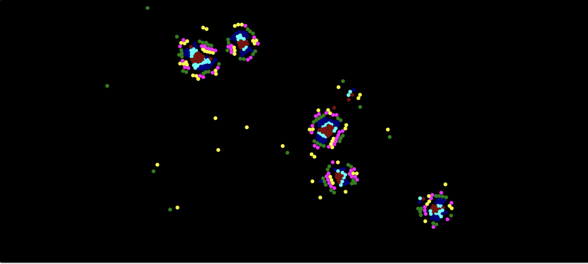

# Particle Life Simulation

## Live Demo
Try the simulation at: [https://thinkyminer.github.io/particleLife/](https://thinkyminer.github.io/particleLife/)

## Overview

This project is an interactive simulation of artificial life based on simple particle interactions. The simulation demonstrates emergent behavior where complex patterns, structures, and behaviors arise from relatively simple rules of particle attraction and repulsion.

Each colored particle represents a different "type" of particle, and each type has a specific set of attraction or repulsion relationships with other types. These interactions create fascinating dynamic patterns that resemble biological systems.

## Features

- **Multiple Presets**: Choose from different simulation behaviors:
  - **Balanced**: General-purpose stable interactions
  - **Chaos**: Rapid, unpredictable movements
  - **Diversity**: Many different particle types with varied behaviors
  - **Frictionless**: Particles move with no friction, creating continuous motion
  - **Gliders**: Particles form groups that travel across the screen
  - **Homogeneity**: Fewer particle types with similar behaviors
  - **Large Clusters**: Particles form large, stable groupings
  - **Medium Clusters**: Particles form medium-sized clusters
  - **Quiescence**: Particles tend toward stable, minimal-movement states
  - **Small Clusters**: Many small groups of particles

- **Interactive Controls**:
  - Follow individual particles by clicking on them
  - Zoom in/out for detailed observation
  - Toggle wrap-around behavior
  - Re-seed particles while maintaining behavior rules
  - Slow motion for detailed observation
  - View detailed parameter information

- **Responsive Canvas**: The simulation automatically adjusts to fit your screen

## How It Works

The simulation is based on a set of rules for each particle:

1. Each particle has a type (represented by color)
2. Each type has specific attraction/repulsion values toward other types
3. Particles have minimum and maximum interaction distances
4. Forces are applied based on distance between particles
5. Particles move according to the sum of all forces acting on them

The emergent complexity comes from these simple rules interacting over time.

## Controls

### Mouse Controls
- **Left Click**: Select and follow a particle
- **Right Click**: Stop following a particle
- **Mouse Wheel**: Zoom in/out

### Button Controls
- **Presets**: Multiple preset configurations
- **Toggle Wrap-Around**: Make particles wrap at screen edges
- **Re-seed Particles**: Randomize particle positions
- **Slow Motion**: Hold to slow down simulation
- **Print Parameters**: Show current simulation parameters
- **Zoom Controls**: Zoom in/out of the simulation
- **Reset View**: Return to default view

### Keyboard Shortcuts
- **B**: Balanced preset
- **C**: Chaos preset
- **D**: Diversity preset
- **F**: Frictionless preset
- **G**: Gliders preset
- **H**: Homogeneity preset
- **L**: Large clusters preset
- **M**: Medium clusters preset
- **Q**: Quiescence preset
- **S**: Small clusters preset
- **W**: Toggle wrap-around
- **Enter**: Re-seed particles
- **Space**: Hold for slow motion
- **Tab**: Print parameters

## Technical Implementation

This simulation is built with vanilla JavaScript using HTML5 Canvas for rendering. The main components include:

- **Universe Class**: Manages the simulation state, particles, and interactions
- **Particle System**: Handles particle creation and behavior
- **Rendering Engine**: Draws particles to the canvas with proper coloring
- **Control System**: Manages user interactions and simulation parameters

The simulation runs an optimized animation loop for smooth performance even with hundreds of particles.

## Getting Started

1. Clone the repository
2. Open `index.html` in a modern web browser
3. Click on different presets to explore behaviors
4. Interact with particles using mouse and keyboard controls

No build tools or external dependencies required!

## License

MIT License

## Author

[ThiNkyMiNeR](https://github.com/thinkyminer)